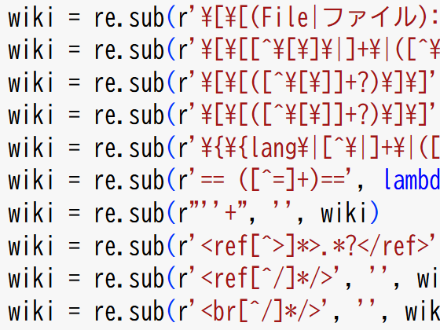
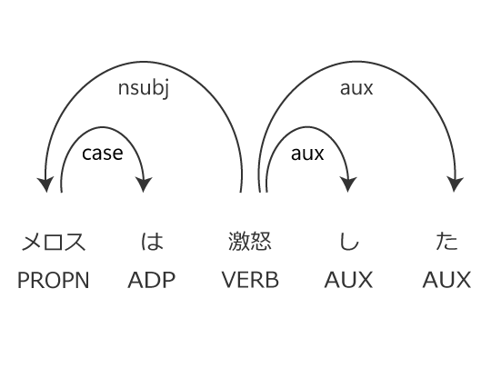
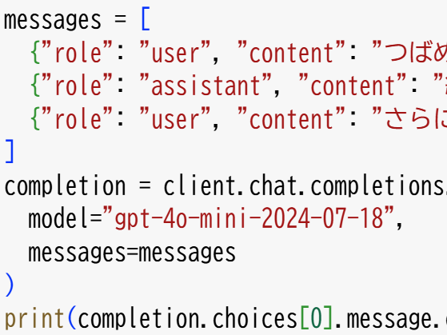
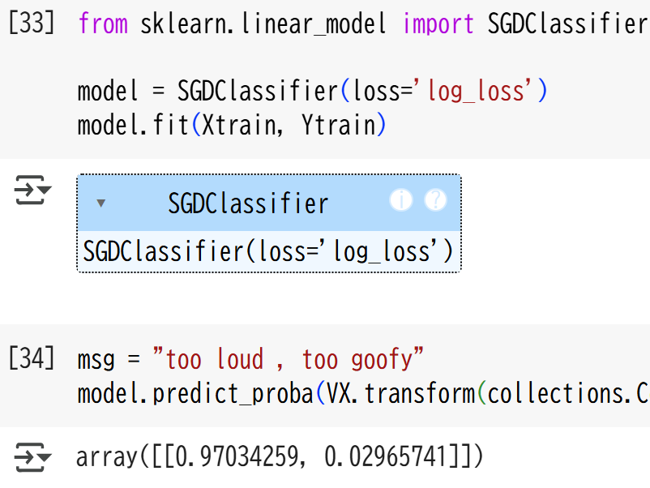
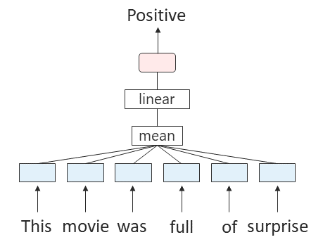
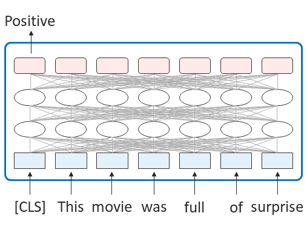
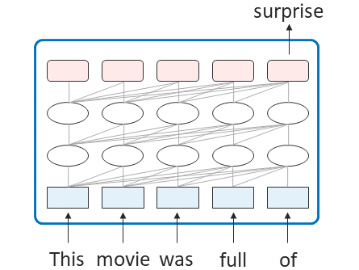

# 言語処理100本ノック 2025 (Rev 1)

```{only} html
[](https://colab.research.google.com/github/chokkan/mlnote/blob/main/)
[](https://studiolab.sagemaker.aws/import/github/chokkan/mlnote/blob/main/classification/01binary.ipynb)
[](https://jupyterbook.org)
[](https://www.python.org/)
[](https://numpy.org/)
[](https://matplotlib.org/)
[](https://scikit-learn.org/)
[](https://pytorch.org/)
[](https://huggingface.co/docs/transformers/)
```

::::{grid} 1 2 3 3
:gutter: 3

:::{grid-item-card} 自然言語処理の基礎 📖
実用的でワクワクするような課題に取り組みながら、自然言語処理、大規模言語モデル、プログラミング、研究のスキルを楽しく習得することを目指した問題集です。
:::

:::{grid-item-card} 第1章: 準備運動
[](ch01.ipynb)
:::

:::{grid-item-card} 第2章: UNIXコマンド
[](ch02.ipynb)
:::

:::{grid-item-card} 第3章: 正規表現
[](ch03.ipynb)
:::

:::{grid-item-card} 第4章: 言語解析
[](ch04.ipynb)
:::

:::{grid-item-card} 第5章: 大規模言語モデル
[](ch05.ipynb)
:::

:::{grid-item-card} 第6章: 単語ベクトル
[](ch06.ipynb)
:::

:::{grid-item-card} 第7章: 機械学習
[](ch07.ipynb)
:::

:::{grid-item-card} 第8章: ニューラルネット
[](ch08.ipynb)
:::

:::{grid-item-card} 第9章: 事前学習済み言語モデル (BERT型)
[](ch09.ipynb)
:::

:::{grid-item-card} 第10章: 事前学習済み言語モデル (GPT型)
[](ch10.ipynb)
:::

:::{grid-item-card} オープンソース 🎁
言語処理100本ノックは、[クリエイティブ・コモンズ 表示 4.0 国際 (CC BY 4.0)](https://creativecommons.org/licenses/by/4.0/deed.ja)で公開しています。Jupyter形式で問題を公開していますので、Google Colaboratoryですぐに始められます。
:::
::::
